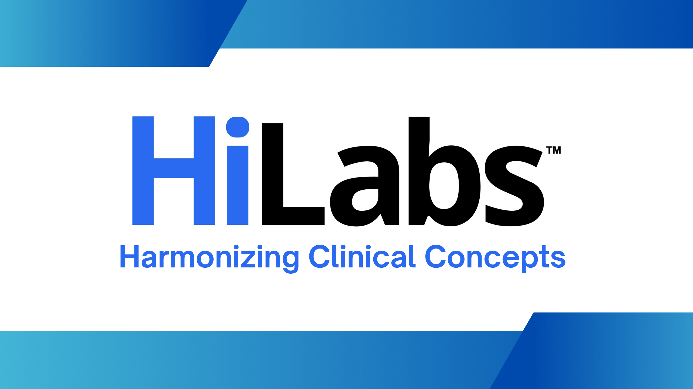
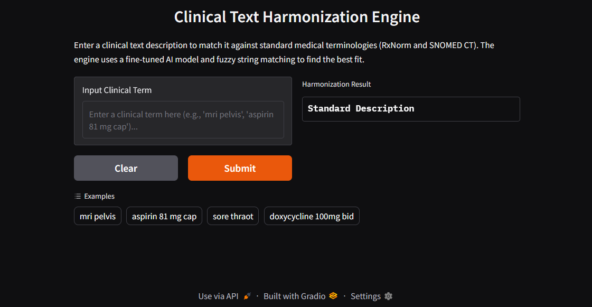

# Clinical Text Harmonization Engine  


## Created by : Nandini Agarwal  


This project provides a complete pipeline for harmonizing clinical text descriptions by matching them to standard medical terminologies (RxNorm and SNOMED CT). It uses a fine-tuned sentence transformer model combined with traditional text matching for robust performance.  

## Project Structure  

- **`config.py`**: Centralized configuration for all file paths, model names, etc.  
- **`data_loader.py`**: Handles loading and preprocessing of all data.  
- **`model_trainer.py`**: Handles the fine-tuning of the AI model.  
- **`harmonizer.py`**: Implements the core matching and scoring logic.  
- **`main.py`**: The main script for batch processing an entire test file.  
- **`app.py`**: A web interface using Gradio for interactive testing.  
- **`requirements.txt`**: A list of all necessary Python packages.  

## Local Setup Instructions  

Follow these steps to set up and run the project on your local machine.  

### 1. Create a Virtual Environment  

It's highly recommended to use a virtual environment to avoid conflicts with other projects.  

```bash  
# Create a virtual environment named 'venv'  
python -m venv venv  

# Activate the virtual environment  
# On Windows:  
venv\Scripts\activate  
# On macOS/Linux:  
source venv/bin/activate  
```  

### 2. Install Dependencies  

Install all the required packages using the `requirements.txt` file.  

```bash  
pip install -r requirements.txt  
```  

### 3. Download Data  

Create a directory named `data` in the root of the project. Place your input files inside this `data` directory:  

- `rxnorm_all_data.parquet`  
- `snomed_all_data.parquet`  
- `Test.xlsx`  

## How to Run  

After setting up the environment, you can run the project in two modes.  

### A) First-Time Setup (Model Training)  

The very first time you run the project, you need to train the model.  

1. Open `main.py`.  
2. Uncomment the lines for the `ModelTrainer`:  

```python  
# print("\nStarting model training...")  
# trainer = ModelTrainer(kb_df)  
# trainer.train()  
```  

3. Run the script. This will train the model and save it to the `./models` directory. It will also build the search indexes. This is a one-time, potentially long-running step.  

```bash  
python main.py  
```  

4. Once training is complete, you can re-comment the training lines in `main.py` so it doesn't run every time.  

### B) Running the Application  

Once the model and indexes are created, you can run either the batch processing script or the interactive web app.  

#### Batch Processing  

To process the entire `Test.xlsx` file and generate a CSV output:  

```bash  
python main.py  
```  

The results will be saved in the `./output` directory.  

#### Interactive Web Interface  


To launch a user-friendly web app for testing individual terms:  

```bash  
python app.py  
```

# Integrated Documentation: Clinical Text Harmonization Engine

## Introduction
This document provides an integrated overview of the Clinical Text Harmonization Engine. The project's mission is to bridge the gap between free-form clinical text and standardized medical terminologies, specifically RxNorm (medications) and SNOMED CT (diagnoses, procedures, labs).

The engine combines a fine-tuned deep learning model with traditional lexical matching algorithms. This documentation outlines the high-level workflow and a detailed module-by-module breakdown of the system's architecture and operation.

---
# Explaination of code

## 1. Step-by-Step Workflow and Technical Architecture

### Part 1: Data Preprocessing and Standard Code Mapping
This phase prepares training data and establishes mappings between descriptive terms and standard codes.

- **Data Ingestion and Cleaning**:
    - Drop missing values to ensure data integrity.
    - Expand abbreviations (e.g., "HTN" → "Hypertension").
    - Convert text to lowercase, remove stop words, punctuation, and numbers using `preprocess_text` in `data_loader.py`.
    - Perform Unicode normalization.

- **Tokenization and Lemmatization**:
    - Tokenize text into words/phrases.
    - Use `WordNetLemmatizer` to reduce tokens to root forms (e.g., "running" → "run").

- **Training Data Mapping and Model Fine-Tuning**:
    - Segregate data into RxNorm and SNOMED CT datasets.
    - Use `model_trainer.py` to create positive training pairs based on Concept Unique Identifiers (CUIs).
    - Fine-tune a SentenceTransformer model (`all-MiniLM-L6-v2`) with `MultipleNegativesRankingLoss` for domain-specific understanding.

### Part 2: Applying the Model to Test Data
This phase identifies standard codes for new clinical text.

- **Candidate Retrieval (BM25 Index)**:
    - Query a BM25 search index with preprocessed input text to retrieve top N matches.

- **Hybrid Scoring**:
    - **Semantic Score**: Use the fine-tuned model to compute cosine similarity between input and candidate embeddings.
    - **Fuzzy Score**: Compare original input and candidate strings using `thefuzz.token_set_ratio`.

- **Dynamic Ensembling and Final Selection**:
    - Combine semantic and fuzzy scores into an Ensemble Score.
    - Adjust weights dynamically based on query length:
        - Short queries prioritize fuzzy scores.
        - Longer queries prioritize semantic scores.
    - Select the candidate with the highest Ensemble Score.

---

## 2. Detailed Module Breakdown

### `config.py` - Configuration Management
Centralizes static variables and parameters (e.g., paths, model names, hyperparameters, `NOISE_TERMS`).

### `data_loader.py` - Data Ingestion and Preparation
The `DataLoader` class handles data loading, standardization, and preprocessing. The `preprocess_text` method is the core text cleaning function.

### `model_trainer.py` - Model Fine-Tuning
The `ModelTrainer` class fine-tunes the AI model for clinical language, generating training pairs and managing the training loop.

### `harmonizer.py` - Core Harmonization Engine
The `Harmonizer` class manages candidate retrieval, scoring, and final selection. The `harmonize_single` method orchestrates the entire process.

### `main.py` & `app.py` - Execution Scripts
- `main.py`: Batch processing for test data.
- `app.py`: Gradio web app for real-time interaction.

---

## 3. Innovation in the Harmonization Engine

### A. Hybrid AI and Lexical Approach
Combines deep learning for semantic understanding with lexical matching for robustness, handling variations in phrasing and minor errors.

### B. Dynamic Ensembling
Adjusts weights for semantic and fuzzy scores dynamically:
- **Short Queries**: Prioritize fuzzy scores.
- **Long Queries**: Prioritize semantic scores.

### C. Domain-Specific Model Fine-Tuning
Fine-tunes a SentenceTransformer model on clinical data, enabling recognition of medical term relationships (e.g., "heart attack" ↔ "myocardial infarction").

### D. Efficient Candidate Retrieval
Uses a BM25 index to narrow the search space, reducing processing time for real-time and batch applications.


Open your web browser and navigate to the local URL shown in the terminal (usually `http://127.0.0.1:7860`).  

